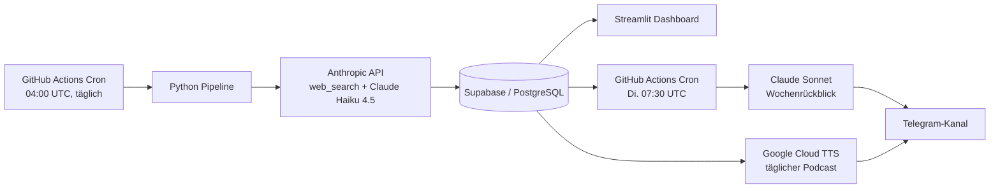
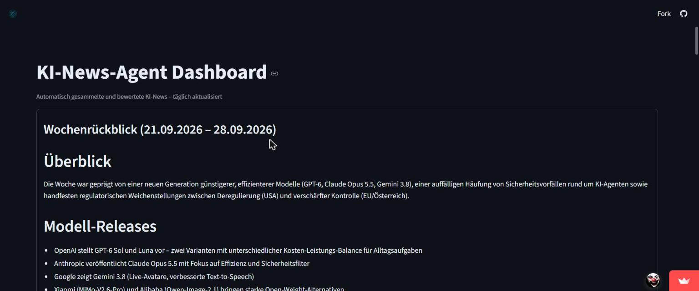
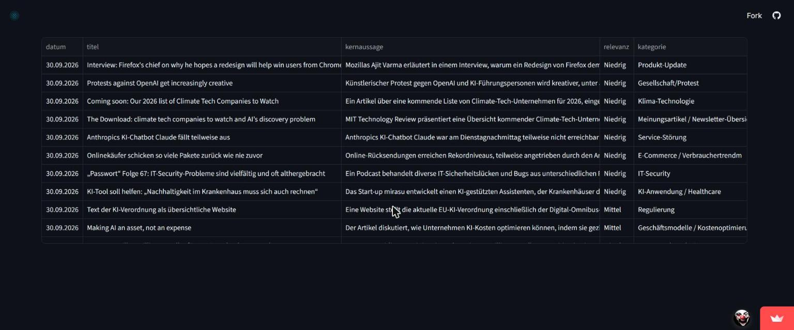
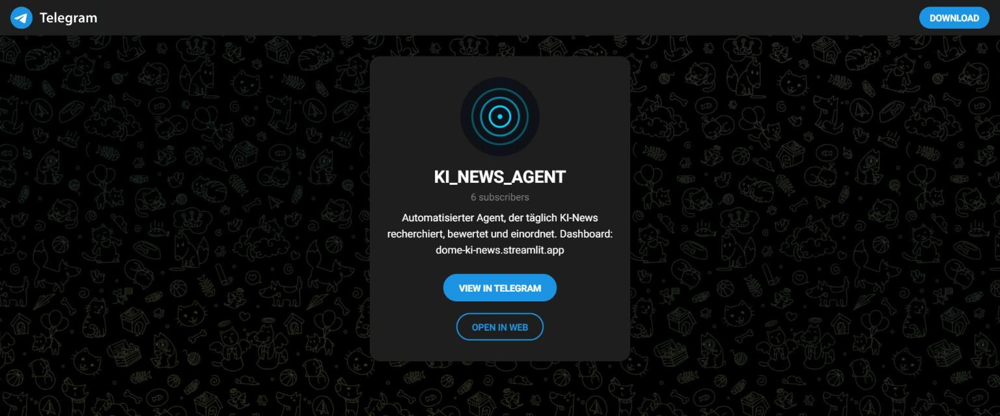

# KI-News-Agent

Automatisierter Research-, Bewertungs- und Distributions-Agent für KI-News — recherchiert täglich eigenständig, bewertet die Relevanz und spielt die Ergebnisse auf mehreren Kanälen aus.

Entstanden als Portfolio-Projekt während der Umschulung zum Fachinformatiker für Systemintegration (FISI).

🔗 **Live-Dashboard:** [dome-ki-news.streamlit.app](https://dome-ki-news.streamlit.app)
📡 **Telegram-Kanal:** [t.me/KI_NEWS_AGENT](https://t.me/KI_NEWS_AGENT)

---

## Was macht das Projekt

Jeden Tag läuft vollautomatisch eine Pipeline, die:

1. aktuelle KI-News recherchiert (Anthropic Web-Search-Tool),
2. die Fundstellen bewertet, kategorisiert und dedupliziert,
3. die Ergebnisse persistent in einer Datenbank ablegt,
4. sie über drei Kanäle ausspielt:
   - **Dashboard** (Streamlit) — laufende Übersicht aller Einträge
   - **Telegram-Kanal** — wöchentlicher Rückblick (Di., 07:30 UTC)
   - **Täglicher Podcast** — gesprochene Zusammenfassung per Text-to-Speech, automatisch im Kanal gepostet

Kein manueller Eingriff nötig — die GitHub-Actions-Cronjobs übernehmen Recherche, Bewertung und Versand komplett eigenständig.

---

## Architektur



**Ablauf:**
- **Daily Run** (`daily_run.yml`, 04:00 UTC): Recherche über Anthropics `web_search`-Tool, Bewertung/Kategorisierung mit Claude Haiku 4.5, Schreiben nach Supabase
- **Weekly Run** (`weekly-summary.yml` + `weekly-telegram-send.yml`, Di. 07:30 UTC): Claude Sonnet fasst die Woche zusammen, anschließend Versand als Wochenrückblick in den Telegram-Kanal
- **Daily Podcast** (`daily-podcast.yml`): Google Cloud TTS generiert eine gesprochene Zusammenfassung des Tages, wird als Audio-Nachricht über den Telegram-Bot verschickt
- **Dashboard**: Streamlit liest live aus Supabase, zeigt laufende Einträge + Wochenrückblicke

---

## Tech-Stack

| Bereich | Technologie |
|---|---|
| Sprache | Python |
| Automatisierung | GitHub Actions (Cron) |
| Datenbank | Supabase (PostgreSQL) |
| KI / Research | Anthropic API — `web_search` Tool, Claude Haiku 4.5 (täglich), Claude Sonnet (Wochenrückblick) |
| Dashboard | Streamlit (Streamlit Community Cloud) |
| Distribution | Telegram Bot API |
| Sprachausgabe | Google Cloud Text-to-Speech |

---

## Datenmodell (Supabase/PostgreSQL)

| Tabelle | Zweck |
|---|---|
| `quellen` | Erfasste Quellen der recherchierten News |
| `kategorien` | Kategorisierung der Einträge |
| `news_eintraege` | Einzelne bewertete News-Einträge (Kern-Tabelle) |
| `wochenrueckblicke` | Generierte wöchentliche Zusammenfassungen |

<!-- TODO Dominik: ggf. Spalten/Relationen ergänzen, falls für Bewerbung relevant -->

---

## Design System

Konsistentes "Dark Tech / Terminal"-Look über Dashboard und Telegram-Kanal hinweg:

- Hintergrund: `#0E1117`
- Akzentfarbe: `#00D9FF` (Cyan)
- Schrift: Inter (Fließtext) + JetBrains Mono (Code/technische Werte)
- Logo: Signal-Motiv

---

## Screenshots





---

## Setup

> Die exakten Secret-Namen unten sind ein Vorschlag auf Basis der bekannten Architektur — bitte gegen deine echte `.env` / GitHub-Secrets-Liste abgleichen und anpassen, bevor das README final committed wird.

### 1. Repo klonen

```bash
git clone https://github.com/Hill-Dominik/ki-news-agent.git
cd ki-news-agent
```

### 2. Dependencies installieren

```bash
pip install -r requirements.txt
pip install -r dashboard/requirements.txt
```

### 3. Umgebungsvariablen (lokal: `.env`, niemals committen)

```env
ANTHROPIC_API_KEY=
SUPABASE_URL=
SUPABASE_KEY=
TELEGRAM_BOT_TOKEN=
TELEGRAM_CHANNEL_ID=
GOOGLE_CLOUD_TTS_CREDENTIALS=
```

`.env` ist über `.gitignore` ausgeschlossen und wird nie ins Repo übernommen.

### 4. GitHub Actions Secrets

Für den automatisierten Betrieb müssen dieselben Variablen als **Repository Secrets** unter *Settings → Secrets and variables → Actions* hinterlegt werden.

### 5. Supabase-Setup

- Projekt in Supabase anlegen
- Tabellen `quellen`, `kategorien`, `news_eintraege`, `wochenrueckblicke` anlegen
- Falls "auto-expose tables" beim Projekt-Setup deaktiviert war: `service_role`- und `anon`-Grants manuell per SQL vergeben

### 6. Streamlit-Dashboard lokal starten

```bash
streamlit run dashboard/app.py
```

Secrets fürs Dashboard: `dashboard/.streamlit/secrets.toml` anlegen (Vorlage: `dashboard/.streamlit/secrets.toml.example`), ebenfalls gitignored.

---

## Projektstruktur

```
ki-news-agent/
├── .devcontainer/
│   └── devcontainer.json
├── .github/
│   └── workflows/
│       ├── daily_run.yml              # Tägliche Recherche & Bewertung
│       ├── daily-podcast.yml          # Täglicher Podcast (Google Cloud TTS)
│       ├── weekly-summary.yml         # Wöchentliche Zusammenfassung erzeugen
│       └── weekly-telegram-send.yml   # Wochenrückblick an Telegram senden
├── .streamlit/
│   └── config.toml
├── config/
│   └── quellen.yaml                   # Konfiguration der News-Quellen
├── dashboard/
│   ├── assets/
│   │   ├── favicon_32.png
│   │   └── logo_transparent_128.png
│   ├── .streamlit/
│   │   └── secrets.toml.example
│   ├── app.py
│   └── requirements.txt
├── src/
│   ├── bewertung.py                   # Bewertung/Kategorisierung der News
│   ├── daily_podcast.py               # Podcast-Generierung
│   ├── db.py                          # Supabase-Verbindung
│   ├── main.py                        # Einstiegspunkt Daily Run
│   ├── send_telegram.py               # Telegram-Versand
│   ├── sources.py                     # Quellen-Handling
│   ├── utils.py                       # Hilfsfunktionen
│   └── weekly_summary.py              # Wochenrückblick-Generierung
├── .env.example
├── .gitignore
├── README.md
└── requirements.txt
```

---

## Sicherheit

- Keine Secrets im Code, in Commits oder im Klartext — ausschließlich über Umgebungsvariablen (lokal `.env`, in der Automatisierung GitHub Actions Secrets)
- `.env` und `dashboard/.streamlit/secrets.toml` sind über `.gitignore` ausgeschlossen
- Supabase: Zugriff nach Least-Privilege-Prinzip, Row-Level-Security-Policies statt offenem Zugriff
- Vor jedem Commit: `git status -u`, um sicherzustellen, dass keine Secret-Dateien versehentlich mitkommen

---

## Testphase & Feedback

Das Projekt lief vier Wochen als Alphaphase mit Nutzer-Feedback aus dem Umschulungs-Jahrgang. Ergebnis:

- ✅ Aussprache-Fix umgesetzt: TTS sprach Akronyme wie "KI" oder "IT" als Wort statt buchstabiert — jetzt per SSML korrigiert
- 💡 Idee für später: mehr inhaltliche Tiefe im täglichen Podcast bei ausgewählten Themen (bewusst zurückgestellt, Format kommt insgesamt gut an)

---

## Autor

Dominik — gebaut im Rahmen der FISI-Umschulung als Lern- und Portfolio-Projekt.
📧 dominik.hill1988@gmail.com

## Lizenz

MIT — siehe [LICENSE](LICENSE).